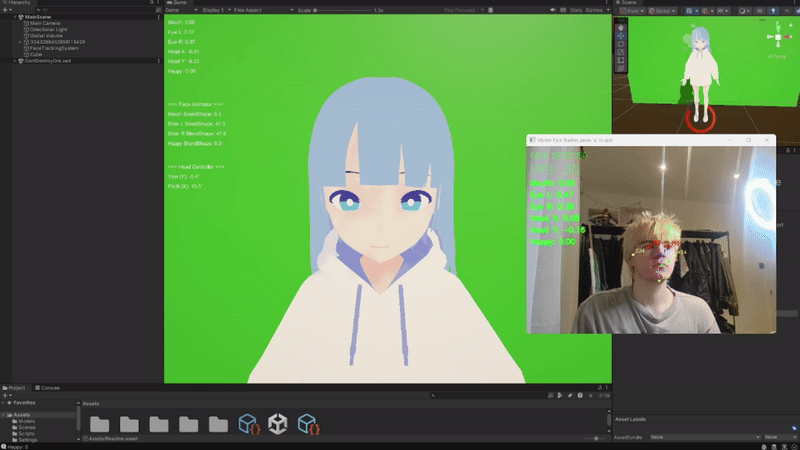

<a id="readme-top"></a>
<!-- PROJECT SHIELDS -->
Show Image
Show Image
Show Image
Show Image
Show Image
<!-- PROJECT LOGO -->
<br />
<div align="center">
  <a href="https://github.com/Zoryanchik/vtuber-simulator">
    
  </a>
  <h3 align="center">VTuber Simulator</h3>
  <p align="center">
    Create your own AI-powered virtual YouTuber with 3D animation and real-time interaction!
    <br />
    <a href="https://github.com/Zoryanchik/vtuber-simulator"><strong>Explore the docs »</strong></a>
    <br />
    <br />
    <a href="https://github.com/Zoryanchik/vtuber-simulator">View Demo</a>
    ·
    <a href="https://github.com/Zoryanchik/vtuber-simulator/issues/new?labels=bug&template=bug-report---.md">Report Bug</a>
    ·
    <a href="https://github.com/Zoryanchik/vtuber-simulator/issues/new?labels=enhancement&template=feature-request---.md">Request Feature</a>
  </p>
</div>
<!-- TABLE OF CONTENTS -->
<details>
  <summary>Table of Contents</summary>
  <ol>
    <li>
      <a href="#about-the-project">About The Project</a>
      <ul>
        <li><a href="#built-with">Built With</a></li>
      </ul>
    </li>
    <li>
      <a href="#getting-started">Getting Started</a>
      <ul>
        <li><a href="#prerequisites">Prerequisites</a></li>
        <li><a href="#installation">Installation</a></li>
      </ul>
    </li>
    <li><a href="#usage">Usage</a></li>
    <li><a href="#contributing">Contributing</a></li>
    <li><a href="#license">License</a></li>
    <li><a href="#contact">Contact</a></li>
    <li><a href="#acknowledgments">Acknowledgments</a></li>
  </ol>
</details>
<!-- ABOUT THE PROJECT -->
## About The Project

<div align="center">
  
</div>

Have you ever wanted to create your own virtual YouTuber?  But struggled to find software that would give you full control over your model? If so, hopefully this project is what you've been looking for!

Here's why this project is cool:

* Your VTuber responds naturally using Python libraries - no scripted responses
* Built with modern, modular architecture so you can easily extend it
* Perfect for learning about Unity-Python integration or building your own streaming companion

Whether you're into VTubers, game development, or AI, this project has something for you!

<p align="right">(<a href="#readme-top">back to top</a>)</p>

## Built With

The major frameworks and technologies powering this project:

* [![Unity][Unity.com]][Unity-url]
* [![Python][Python.org]][Python-url]
* [![OpenCV][OpenCV.org]][OpenCV-url]
* [![MediaPipe][MediaPipe.dev]][MediaPipe-url]
* [![NumPy][NumPy.org]][NumPy-url]
* [![C#][CSharp.net]][CSharp-url]

<p align="right">(<a href="#readme-top">back to top</a>)</p>

<!-- GETTING STARTED -->
## Getting Started

Ready to get your own VTuber up and running? Follow these steps and you'll be chatting with your virtual character in no time.

### Prerequisites

Make sure you have these installed before we begin:

* Unity 2020.3 or newer (the free Personal edition works great)
* Python 3.8 or higher
* pip (comes with Python)

```sh
python --version  # Should be 3.8+
pip --version     # Make sure it's installed
```

### Installation

1. Clone the repo

```sh
git clone https://github.com/Zoryanchik/vtuber-simulator.git
cd vtuber-simulator
```

2. Install Python dependencies

```sh
pip install -r requirements.txt
```

3. Open the Unity project

   * Launch Unity Hub
   * Click "Add" and select the Unity/VtbuerSimulator folder
   * Open the project (first load might take a few minutes)

4. Configure your settings (if needed)

   * Add any API keys to config.json
   * Adjust character settings in Unity Inspector

You're all set! Check out the Usage section to run it.

<p align="right">(<a href="#readme-top">back to top</a>)</p>

<!-- USAGE EXAMPLES -->
## Usage

### Running the VTuber

1. Start the Python backend first:

```sh
cd python
python main.py
```
You should see output indicating the server is running.

2. Launch Unity:

   * Open the Unity project
   * Load the main scene from Assets/Scenes/MainScene
   * Hit the Play button ▶️

3. Interact with your VTuber:

   * Try moving your head or showing some emotion
   * Watch your character respond with animations

For more examples and advanced usage, please refer to the [Documentation](https://github.com/Zoryanchik/vtuber-simulator)

<p align="right">(<a href="#readme-top">back to top</a>)</p>


See the [open issues](https://github.com/Zoryanchik/vtuber-simulator/issues) for a full list of proposed features (and known issues).

<p align="right">(<a href="#readme-top">back to top</a>)</p>

<!-- CONTRIBUTING -->
## Contributing

Contributions are what make the open source community such an amazing place to learn, inspire, and create. Any contributions you make are **greatly appreciated**.

If you have a suggestion that would make this better, please fork the repo and create a pull request. You can also simply open an issue with the tag "enhancement".
Don't forget to give the project a star! Thanks again!

1. Fork the Project
2. Create your Feature Branch (`git checkout -b feature/AmazingFeature`)
3. Commit your Changes (`git commit -m 'Add some AmazingFeature'`)
4. Push to the Branch (`git push origin feature/AmazingFeature`)
5. Open a Pull Request

Top contributors:

<a href="https://github.com/Zoryanchik/vtuber-simulator/graphs/contributors">
  
</a>

<p align="right">(<a href="#readme-top">back to top</a>)</p>

<!-- LICENSE -->
## License

Distributed under the MIT License. See `LICENSE` for more information.

<p align="right">(<a href="#readme-top">back to top</a>)</p>

<!-- CONTACT -->
## Contact

My linkedin: https://www.linkedin.com/in/zorian-mart-440b88333/
Project Link: [https://github.com/Zoryanchik/vtuber-simulator](https://github.com/Zoryanchik/vtuber-simulator)

<p align="right">(<a href="#readme-top">back to top</a>)</p>

<!-- ACKNOWLEDGMENTS -->
## Acknowledgments

Resources and inspirations that helped make this project possible:

* [Unity Documentation](https://docs.unity3d.com/)
* [Python Official Docs](https://docs.python.org/)
* [Choose an Open Source License](https://choosealicense.com)
* [GitHub Emoji Cheat Sheet](https://www.webpagefx.com/tools/emoji-cheat-sheet)
* [Img Shields](https://shields.io)
* [Font Awesome](https://fontawesome.com)

<p align="right">(<a href="#readme-top">back to top</a>)</p>

<!-- MARKDOWN LINKS & IMAGES -->
[Unity.com]: https://img.shields.io/badge/Unity-000000?style=for-the-badge&logo=unity&logoColor=white
[Unity-url]: https://unity.com/
[Python.org]: https://img.shields.io/badge/Python-3776AB?style=for-the-badge&logo=python&logoColor=white
[Python-url]: https://www.python.org/
[OpenCV.org]: https://img.shields.io/badge/OpenCV-5C3EE8?style=for-the-badge&logo=opencv&logoColor=white
[OpenCV-url]: https://opencv.org/
[MediaPipe.dev]: https://img.shields.io/badge/MediaPipe-0097A7?style=for-the-badge&logo=google&logoColor=white
[MediaPipe-url]: https://google.github.io/mediapipe/
[NumPy.org]: https://img.shields.io/badge/NumPy-013243?style=for-the-badge&logo=numpy&logoColor=white
[NumPy-url]: https://numpy.org/
[CSharp.net]: https://img.shields.io/badge/C%23-239120?style=for-the-badge&logo=csharp&logoColor=white
[CSharp-url]: https://docs.microsoft.com/en-us/dotnet/csharp/
